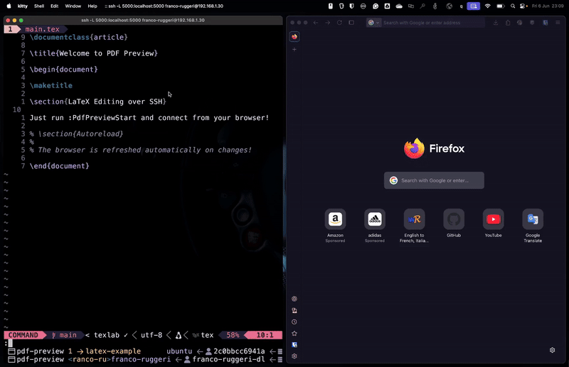

# PDF Preview 🧾🔍

## Overview

A Neovim plugin for easily previewing PDF documents in your browser, with
automatic reloading on file changes. This plugin is ideal for a minimalist LaTeX
editing workflow, even remotely over SSH.



## ✨ Features

- 🔄 Auto-reloading: Refreshes the browser when your PDF file changes.
- 🔌 Remote-friendly: Works over SSH with port forwarding.
- 🧠 LSP-aware: Automatically detects project root from your LSP client.
- ⚙️ Minimal config: Simple `setup()` with sensible defaults.
- 🪞 Transparent: No side effects in your project.

## ⚡ Requirements

- Node.js (for `npm` and `npx`)

## 📦 Installation

Using [lazy.nvim](https://github.com/folke/lazy.nvim) :

```lua
{ 
    "franco-ruggeri/pdf-preview.nvim", 
    opts = {
        -- Override defaults here
    }
    config = function(_, opts)
        require("pdf-preview").setup()

        -- Add your keymaps here
    end
}
```

## Usage

The following user commands are created:

- `:PdfPreviewStart` : Start the live preview server.
- `:PdfPreviewStop` : Stop the preview server.

After using `:PdfPreviewStart`, open the printed URL (e.g.,
<http://localhost:5000>) in your browser.

## Configuration

The default configuration is as follows:

```lua
{
    -- PDF filepath relative to the project root directory
    pdf_filepath = "main.pdf",
    -- Port where the browser-sync server listen on. 
    -- If already in use, the port will be incremented until an available port 
    -- is found.
    port = 5000,
    -- Debounce delay for refresh events in milliseconds
    reload_debouce = 500,
}
```

## Workflow Tips

### LaTeX

This plugin works nicely with LaTeX. Just compile the LaTeX project into a PDF
document.

For instance, you can:

- Install the `texlab` LSP server using `mason.nvim`.
- Configure `texlab` to compile on save.

    ```lua
  vim.lsp.config("texlab", {
      settings = {
          texlab = {
              build = {
                  onSave = true,
              },
          },
      },
  })
  ```

The `texlab` LSP server will take care of compiling on save, and `pdf-preview`
will watch for changes in the output PDF document.

### Remote

You can use SSH port forwarding to view the PDF remotely:

```bash
ssh -L 5000:localhost:5000 user@remote
```

## Contributing

All contributions are welcome! Open an issue to discuss ideas and open a pull
request once agreed.
